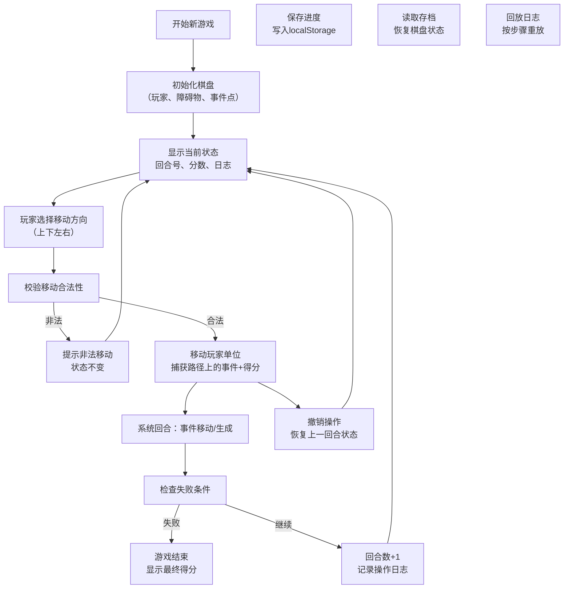

## 1. 产品概述

一款纯本地可玩的回合制巡逻棋小游戏，玩家在网格地图中规划巡逻路径，通过捕获事件点获得分数，同时避开障碍物和危险事件。支持存档、读档、撤销操作和日志回放功能。

- 核心玩法：玩家控制巡逻单位在网格中移动，系统按回合生成或移动事件点
- 目标用户：休闲游戏玩家，喜欢策略和规划类游戏的用户
- 产品价值：提供无需联网的轻量级策略游戏体验，支持进度保存和操作复盘

## 2. 核心功能

### 2.1 用户角色

| 角色 | 注册方式 | 核心权限 |
|------|----------|----------|
| 玩家 | 无需注册，本地直接游玩 | 开始新游戏、移动巡逻单位、撤销操作、保存/读取进度、查看回放日志 |

### 2.2 功能模块

1. **游戏主界面**：网格棋盘、玩家单位、事件点、障碍物、状态栏
2. **操作系统**：方向移动、回合推进、撤销上一回合
3. **事件系统**：事件生成、事件移动、事件捕获、得分计算
4. **存档系统**：本地保存进度、读取存档、多存档槽位
5. **日志系统**：操作记录、回放功能、历史浏览

### 2.3 页面详情

| 页面名称 | 模块名称 | 功能描述 |
|----------|----------|----------|
| 游戏主页面 | 棋盘显示 | 8x8网格地图，显示玩家位置、事件点、障碍物 |
| 游戏主页面 | 状态栏 | 显示当前回合数、得分、游戏状态 |
| 游戏主页面 | 控制按钮 | 新游戏、撤销、保存、读取、回放 |
| 游戏主页面 | 操作提示 | 显示移动合法性提示、捕获事件提示 |
| 游戏主页面 | 日志面板 | 显示每回合操作记录，支持回放 |
| 存档弹窗 | 存档列表 | 显示多个存档槽位及时间戳，支持覆盖和读取 |

## 3. 核心流程

玩家开始新游戏 → 棋盘初始化（玩家、障碍物、初始事件点）→ 玩家选择移动方向 → 系统校验移动合法性 → 合法则移动并捕获路径上的事件 → 系统回合（事件移动/生成）→ 检查失败条件 → 重复或游戏结束 → 可随时保存/读取/撤销

## 4. 用户界面设计

### 4.1 设计风格

- **主色调**：深蓝/藏青色 (#1a2942) 作为背景，配合科技感的荧光绿 (#4ade80) 作为玩家单位色，橙红色 (#f97316) 作为事件点色，灰色 (#6b7280) 作为障碍物
- **辅助色**：金色 (#fbbf24) 用于得分和高亮，红色 (#ef4444) 用于危险提示
- **按钮风格**：圆角矩形，带有微立体阴影，悬停时有发光效果
- **字体**：使用 JetBrains Mono 等宽字体作为数字和日志显示，Noto Sans SC 作为中文界面
- **布局风格**：左侧棋盘主体，右侧状态栏和控制面板，底部日志面板
- **整体风格**：复古像素风与现代科技感结合，类似经典战棋游戏的现代重制版

### 4.2 页面设计概览

| 页面名称 | 模块名称 | UI元素 |
|----------|----------|--------|
| 游戏主页面 | 棋盘网格 | 8x8方格，格子hover效果，玩家单位带发光边框 |
| 游戏主页面 | 状态栏 | 大字号显示回合数、分数，游戏状态徽章 |
| 游戏主页面 | 方向控制 | 十字方向键布局，键盘WASD/方向键支持 |
| 游戏主页面 | 功能按钮 | 新游戏、撤销、保存、读取、回放 |
| 游戏主页面 | 日志面板 | 可滚动的时间线式操作记录 |
| 存档弹窗 | 存档槽位 | 卡片式存档列表，显示时间、回合数、分数 |

### 4.3 响应式设计

- 桌面端优先设计，支持1024px及以上分辨率
- 平板端：左右布局改为上下布局，日志面板移至底部
- 移动端：棋盘自适应缩放，按钮区域增大以适配触摸操作

### 4.4 动效设计

- 玩家移动：平滑过渡动画，路径高亮
- 事件捕获：粒子爆炸效果，分数弹出动画
- 非法移动：震动反馈+红色闪烁
- 回合切换：淡入淡出过渡
- 悬停效果：按钮发光、格子高亮
