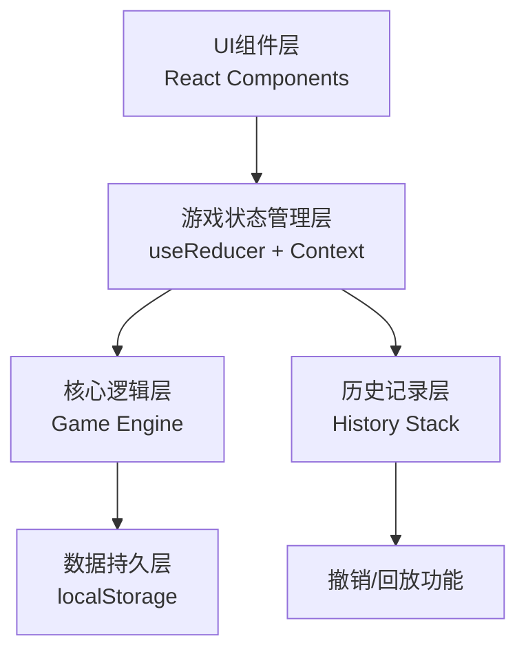

## 1. 架构设计

纯前端单页应用，无需后端服务，所有数据存储在浏览器本地。采用React组件化架构，状态管理使用React内置的useState/useReducer，本地存储使用localStorage。



## 2. 技术选型说明

- **前端框架**: React@18 + TypeScript - 类型安全，组件化开发
- **构建工具**: Vite@5 - 快速开发体验
- **样式方案**: TailwindCSS@3 - 原子化CSS，快速构建UI
- **图标方案**: Lucide React - 现代化图标库
- **本地存储**: localStorage API - 无需后端，纯本地存储
- **状态管理**: React useReducer + Context - 轻量级状态管理，适合游戏状态

## 3. 路由定义

| 路由 | 页面 | 说明 |
|------|------|------|
| / | 游戏主页面 | 包含棋盘、状态栏、控制面板、日志面板 |

由于是单页面游戏，实际使用HashRouter或BrowserRouter但只有一个路由，主要用于页面刷新时的状态恢复。

## 4. 数据模型定义

### 4.1 核心数据结构

```typescript
// 格子坐标
interface Position {
  x: number;  // 0-7
  y: number;  // 0-7
}

// 格子类型
type CellType = 'empty' | 'obstacle' | 'event' | 'player';

// 事件类型
type EventType = 'normal' | 'bonus' | 'danger';

// 事件点
interface GameEvent {
  id: string;
  position: Position;
  type: EventType;
  score: number;     // 普通+10，奖励+30，危险-20
}

// 格子状态
interface Cell {
  position: Position;
  type: CellType;
  event?: GameEvent;
}

// 游戏状态
interface GameState {
  board: Cell[][];           // 8x8棋盘
  playerPosition: Position;
  events: GameEvent[];
  obstacles: Position[];
  turn: number;
  score: number;
  isGameOver: boolean;
  gameOverReason?: string;
  logs: LogEntry[];
}

// 日志条目
interface LogEntry {
  turn: number;
  action: 'move' | 'capture' | 'system' | 'gameover';
  direction?: 'up' | 'down' | 'left' | 'right';
  from?: Position;
  to?: Position;
  capturedEvent?: GameEvent;
  scoreChange?: number;
  message: string;
  timestamp: number;
}

// 存档数据
interface SaveData {
  id: string;
  name: string;
  createdAt: number;
  updatedAt: number;
  gameState: GameState;
  history: GameState[];  // 用于撤销
}

// 游戏动作类型
type GameAction =
  | { type: 'NEW_GAME' }
  | { type: 'MOVE'; direction: 'up' | 'down' | 'left' | 'right' }
  | { type: 'UNDO' }
  | { type: 'LOAD_SAVE'; saveData: SaveData }
  | { type: 'REPLAY_START' }
  | { type: 'REPLAY_NEXT' }
  | { type: 'REPLAY_END' };
```

### 4.2 本地存储键名

```typescript
const STORAGE_KEYS = {
  SAVES: 'patrol_chess_saves',      // 所有存档
  AUTO_SAVE: 'patrol_chess_auto',   // 自动存档
  SETTINGS: 'patrol_chess_settings' // 设置
};
```

## 5. 核心模块设计

### 5.1 游戏引擎模块 (gameEngine.ts)

负责游戏核心逻辑：
- `initializeBoard()`: 初始化棋盘，随机生成障碍物和初始事件
- `validateMove(state: GameState, direction: Direction): boolean`: 验证移动合法性
- `movePlayer(state: GameState, direction: Direction): GameState`: 执行玩家移动
- `processSystemTurn(state: GameState): GameState`: 系统回合处理（事件移动/生成）
- `checkGameOver(state: GameState): { isOver: boolean; reason?: string }`: 检查失败条件
- `captureEvents(state: GameState, position: Position): { events: GameEvent[]; score: number }`: 捕获事件计算

### 5.2 状态管理模块 (useGameState.ts)

自定义Hook封装游戏状态：
- 使用useReducer管理游戏状态
- 维护历史状态栈用于撤销功能
- 封装存档/读档逻辑
- 提供回放功能

### 5.3 存档管理模块 (storage.ts)

本地存储操作：
- `saveGame(slot: number, name: string): void`: 保存游戏到指定槽位
- `loadGame(slot: number): SaveData | null`: 从指定槽位读取存档
- `listSaves(): SaveData[]`: 获取所有存档列表
- `deleteSave(slot: number): void`: 删除存档
- `autoSave(): void`: 自动存档

### 5.4 回放模块 (replay.ts)

日志回放功能：
- `startReplay(): void`: 开始回放，重置到初始状态
- `nextStep(): boolean`: 执行下一步回放
- `prevStep(): boolean`: 执行上一步
- `jumpTo(turn: number): void`: 跳转到指定回合

## 6. 组件结构

```
src/
├── components/
│   ├── Board.tsx           # 棋盘组件
│   ├── Cell.tsx            # 单个格子组件
│   ├── Player.tsx          # 玩家单位组件
│   ├── EventMarker.tsx     # 事件点组件
│   ├── StatusBar.tsx       # 状态栏
│   ├── ControlPanel.tsx    # 控制面板（方向键+功能按钮）
│   ├── LogPanel.tsx        # 日志面板
│   ├── SaveModal.tsx       # 存档弹窗
│   └── ReplayControls.tsx  # 回放控制
├── hooks/
│   ├── useGameState.ts     # 游戏状态管理Hook
│   └── useKeyboard.ts      # 键盘监听Hook
├── game/
│   ├── types.ts            # 类型定义
│   ├── gameEngine.ts       # 游戏核心逻辑
│   ├── storage.ts          # 本地存储
│   └── replay.ts           # 回放逻辑
├── App.tsx                 # 主应用组件
└── main.tsx                # 入口文件
```

## 7. 游戏规则实现要点

### 7.1 初始化规则
- 8x8网格，玩家从(0,0)开始
- 随机生成8-12个障碍物，不包含起始位置
- 初始生成3个普通事件、1个奖励事件
- 回合数从1开始，分数从0开始

### 7.2 移动规则
- 玩家每回合可向上下左右移动1格
- 不能移动到棋盘外
- 不能移动到障碍物格子
- 非法移动时，回合数、分数、事件位置均不变化，并提示"非法移动"

### 7.3 事件系统
- 普通事件（橙色）：+10分
- 奖励事件（金色）：+30分
- 危险事件（红色）：-20分
- 玩家移动到事件格子即捕获该事件，事件消失
- 系统回合：50%概率移动现有事件1格，30%概率生成新事件，20%无变化

### 7.4 失败条件
- 玩家与危险事件碰撞（移动到危险事件格子）
- 回合数达到50回合仍未达到100分
- 分数为负时游戏结束

### 7.5 撤销规则
- 可撤销到上一回合开始前的状态
- 撤销后恢复所有事件位置、分数、回合数
- 撤销次数不限，直到初始状态

### 7.6 存档规则
- 5个手动存档槽位 + 1个自动存档
- 存档包含完整棋盘状态、历史记录、回放日志
- 读取存档后可继续游戏或回放
